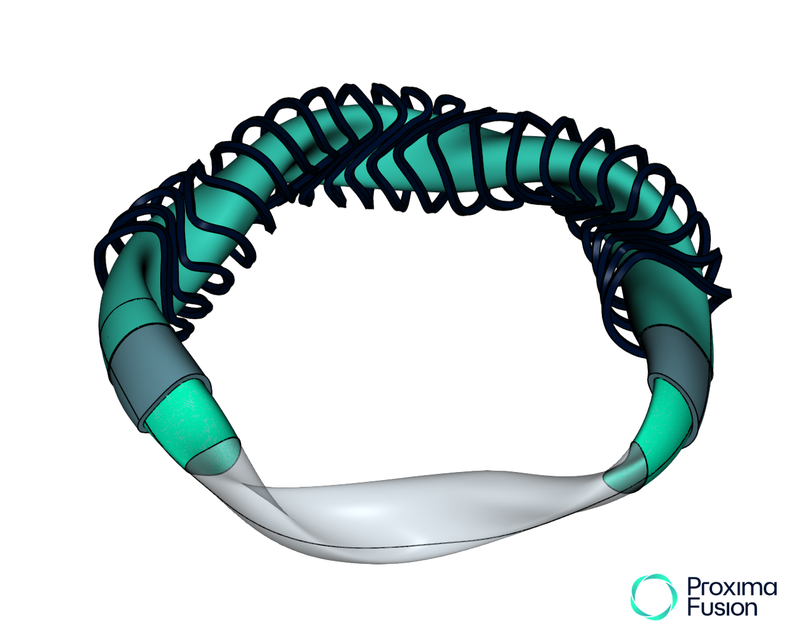

# Open Stellarator Models



This repository contains simplified stellarator CAD models shared under a permissive usage license.

The CAD models contained within this repository are significantly simplified compared to the more detailed models created for internal analysis workflows.

The generic stellarator models provided may be of use to the stellarator and fusion energy communities.

A potential use of these models is as a computational benchmark for simulations codes such as [OpenMC](https://github.com/openmc-dev/openmc) and [DAGMC](https://github.com/svalinn/DAGMC).

If you make use of these models please consider citing this repository.
```
@software{Proxima_Fusion_Open_Stellarator_Models_2025,
author = {Proxima Fusion},
month = apr,
title = {{Open Stellarator Models}},
url = {https://github.com/proximafusion/open_stellarator_models},
version = {0.1.0},
year = {2025}
}
```

- The scaled_w7x_stellarator.step CAD model is built around a scaled W7X plasma. The plasma has been scaled to power plant relevant sizes and the magnets have been shaped to allow space for a breeder blanket inbetween the magnet and firstwall. The radial build contains four uniform thickness layers representing the a gap between the plasma and firstwall (4cm), firstwall (2cm) breeder blanket (55cm) and vessel wall (4cm).
